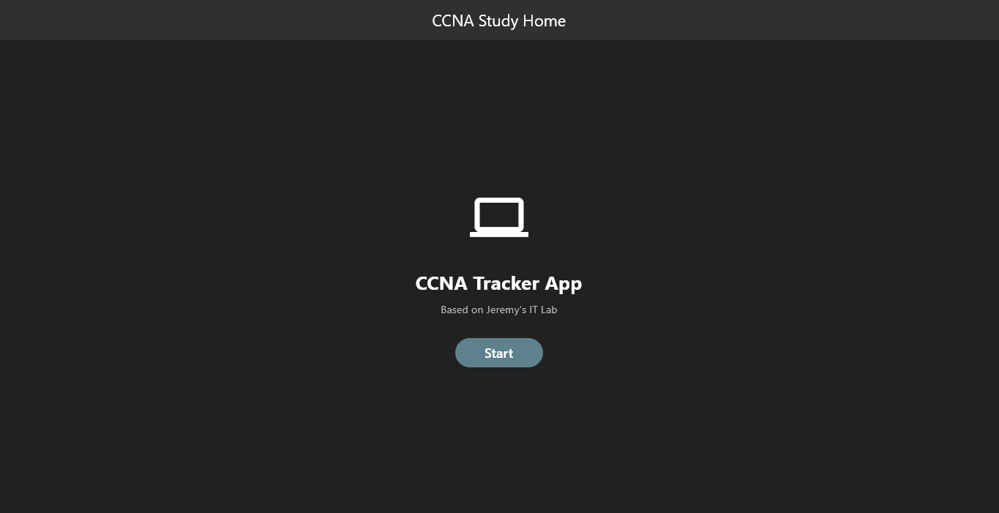
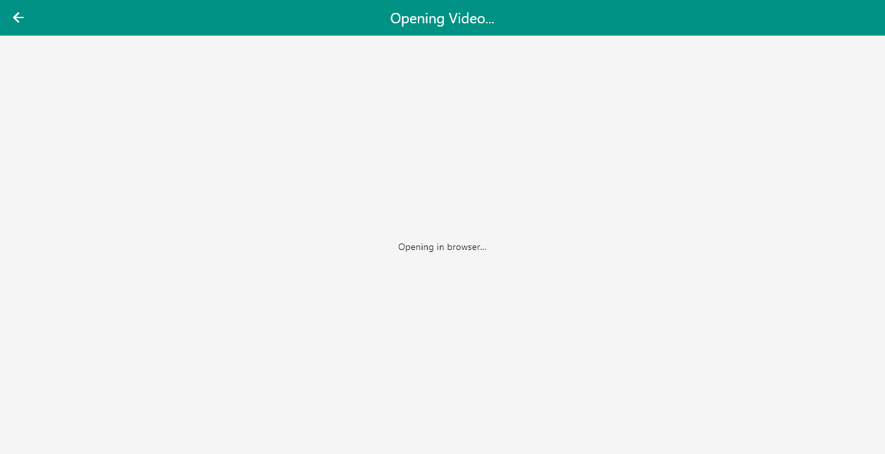
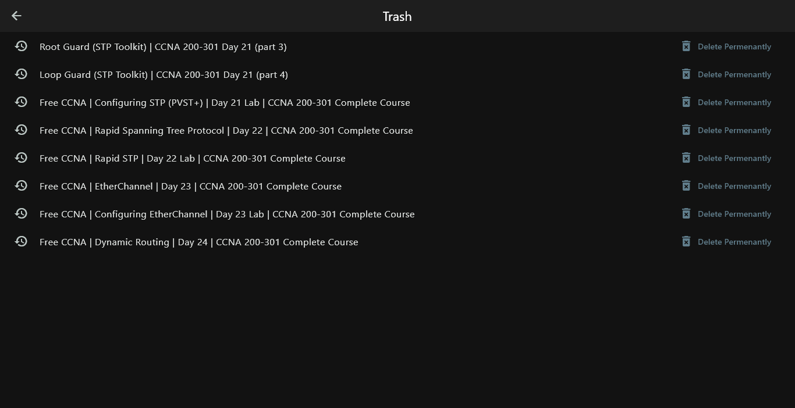
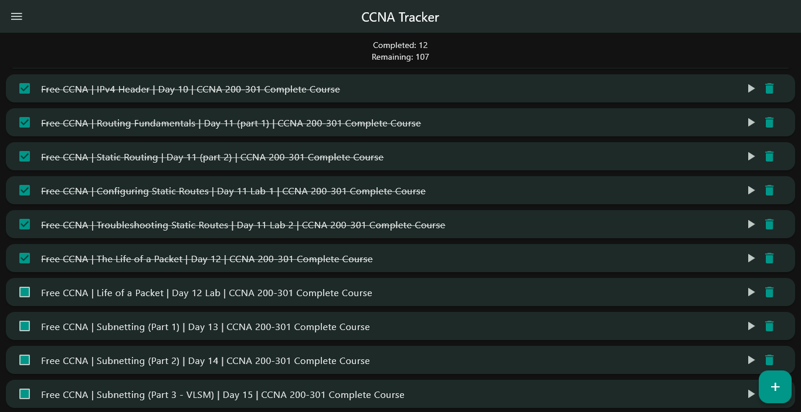
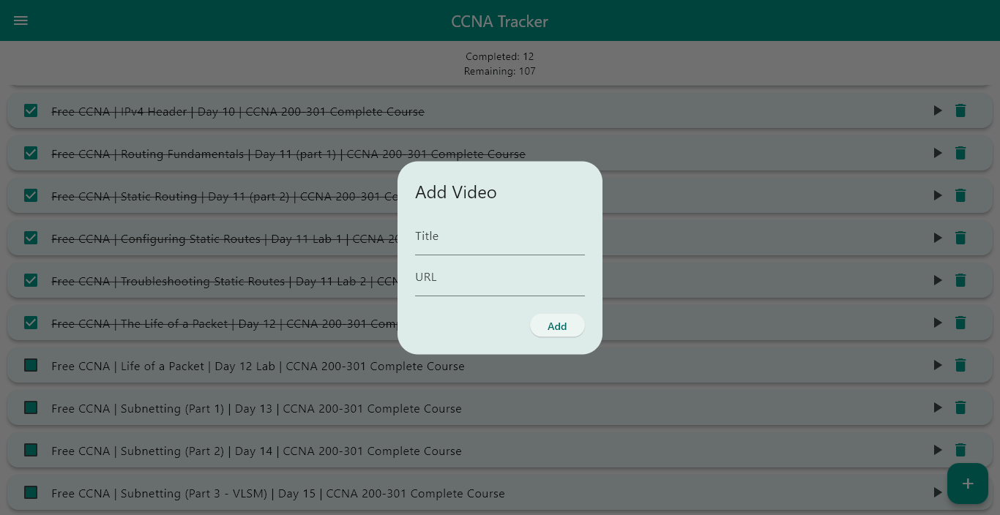
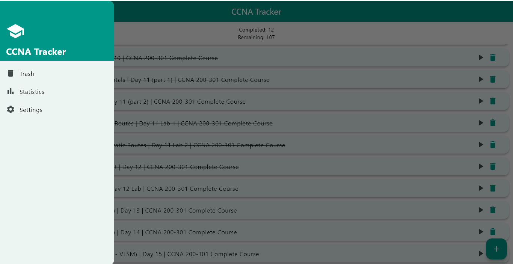
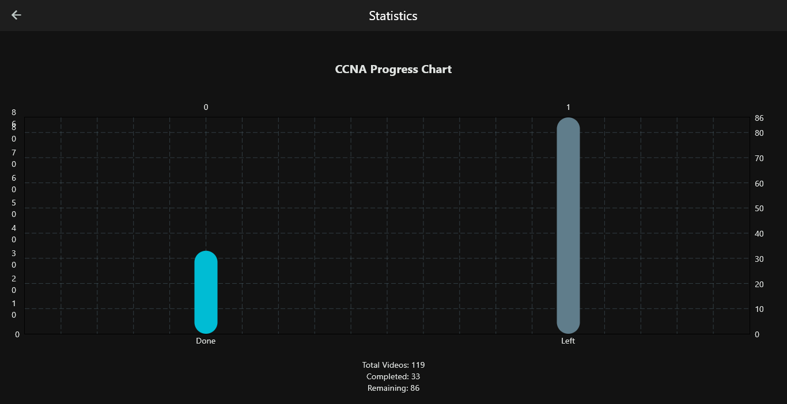

CCNA Study Tracker
A feature-rich Flutter application designed to streamline the study process for the Cisco Certified Network Associate (CCNA 200-301) certification. This app helps students organize their learning path, track progress, and manage resources in one centralized dashboard.

# Key Features
Curated Learning Path: Integrated support for Jeremy’s IT Lab CCNA 200-301 playlist, allowing users to follow the industry-standard curriculum directly within the app.

Progress Tracking: Interactive checklist system with visual indicators to mark completed videos, labs, and topics.

Thumbnail-Based Navigation: Intuitive, card-based UI that uses video thumbnails for quick visual identification of study modules.

Dynamic Theme Support: Customize your study environment with multiple built-in light and dark themes.

Statistics Dashboard: Real-time progress visualization to help you stay motivated and monitor your exam readiness.

Resource Management: Built-in links for supplementary materials, including trash/recycling documentation and external networking tools.

# Tech Stack
- Framework: Flutter
- Language: Dart
- State Management: Flutter `setState()`
- Storage: SharedPreferences
- Charts & Analytics: fl_chart
- Web Content: webview_flutter
- External Links: url_launcher

# Screenshots

Home Screen

Video Player

Trash

CheckList

Add URL

Features

Statistics

Themes

